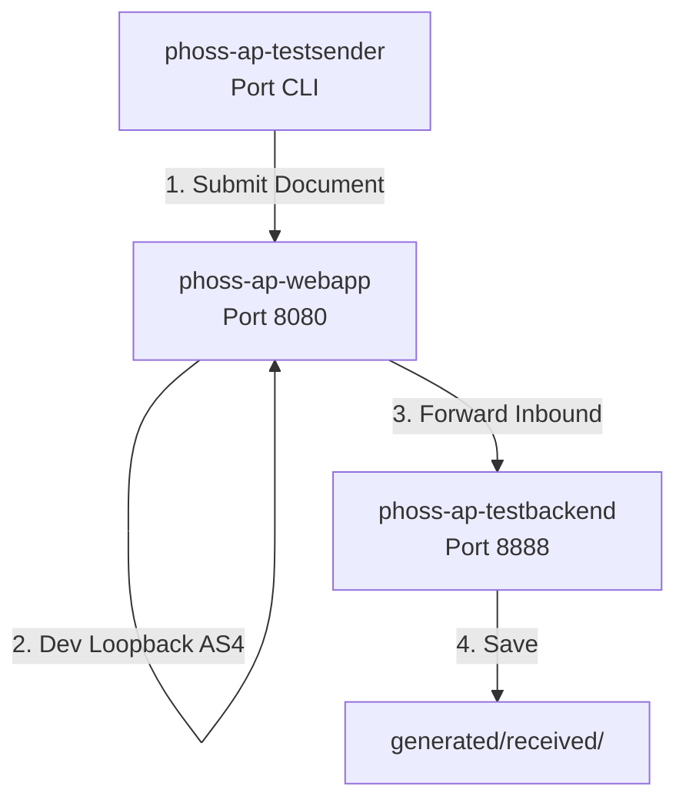

# Local Loopback Testing Guide for phoss AP

This guide explains how to test both **sending** and **receiving** Peppol documents entirely on `localhost` (without needing a real Peppol network, DNS, or live SMP registry) using the built-in loopback mode and test modules.

## Architecture



1. **`phoss-ap-testsender`** (outbound CLI) submits a sample document to **`phoss-ap-webapp`** (Access Point).
2. **`phoss-ap-webapp`** receives the outbound request and—because `outbound.dev-loopback.enabled=true` is set—bypasses the external SMP lookup and sends the AS4 message directly back to itself (`http://localhost:8080/as4`).
3. **`phoss-ap-webapp`** receives the inbound AS4 message on `/as4` and automatically forwards it to the configured forwarding URL (`http://localhost:8888/forwarding/url/async`).
4. **`phoss-ap-testbackend`** (inbound receiver) running on port `8888` receives the forwarded document and writes it to `generated/received/`.

---

## Step-by-Step Testing Guide

### 1. Configure the Webapp for Local Testing
To avoid modifying the tracked `application.properties` file, create a new file named `application-private.properties` in:
`phoss-ap-webapp/src/main/resources/application-private.properties`

And add your local loopback, database, and keystore configuration properties:
```properties
# Enable local loopback for testing outbound -> inbound on localhost
outbound.dev-loopback.enabled=true
phase4.endpoint.address=http://localhost:8080/as4

# DB2 Database config
phossap.jdbc.database-type=db2
phossap.jdbc.driver=com.ibm.db2.jcc.DB2Driver
phossap.jdbc.url=jdbc:db2://localhost:50000/phossap
phossap.jdbc.user=db2inst1
phossap.jdbc.password=peppol
phossap.jdbc.schema=ap

# AS4 Keystore credentials
org.apache.wss4j.crypto.merlin.keystore.type=jks
org.apache.wss4j.crypto.merlin.keystore.file=ap2026testg3.jks
org.apache.wss4j.crypto.merlin.keystore.password=peppol
org.apache.wss4j.crypto.merlin.keystore.alias=apcert
org.apache.wss4j.crypto.merlin.keystore.private.password=peppol
```

*(Note: `application-private.properties` is already git-ignored in the root `.gitignore` file).*

### 2. Start the Webapp with the private Profile
To load the `application-private.properties` file, start the webapp using the `private` Spring Boot profile:
```bash
# PowerShell
mvn -pl phoss-ap-webapp spring-boot:run "-Dspring-boot.run.profiles=private"

# Command Prompt / Bash
mvn -pl phoss-ap-webapp spring-boot:run -Dspring-boot.run.profiles=private
```

### 3. Start the Mock Test Backend (Port `8888`)
Open a new terminal window in the project root and start the test backend to listen for forwarded documents:

```bash
mvn -pl phoss-ap-testbackend spring-boot:run
```

### 4. Compile and Run the Test Sender
In another terminal window in the project root, package the modules and execute the CLI testsender to transmit a single test XML invoice:

```bash
# Build the modules
mvn clean install -DskipTests

# Run the test sender in single-document mode
mvn -pl phoss-ap-testsender spring-boot:run -Dspring-boot.run.arguments="--testsender.bulk.enabled=false"
```

---

## Verifying Results

Once the testsender completes, you should check the logs/output on all three processes:

* **`phoss-ap-webapp`**: Will log that it bypassed the SMP lookup and sent the AS4 message to `http://localhost:8080/as4`. It will then log receiving it and forwarding it.
* **`phoss-ap-testbackend`**: Will log that it received a document and saved it under `generated/received/`.
